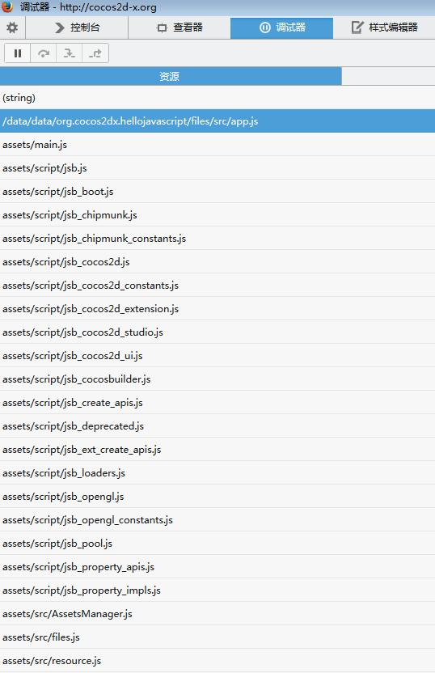

# cocos2d-js热更新

------

## 1. 热更新基本思路

------

得到cocoachina论坛上fysp和akira_cn的帮助，理清了游戏热更新的思路：

- 执行AssetsManager后，搜索路径增加了jsb.fileUtils.getWritablePath()目录，并且是优先搜索；
- 需要热更新js不放在project.json中定义，等AssetsManager更新完了，用cc.loader.load动态加载；
- 所以在jsb.fileUtils.getWritablePath()目录下载的资源和js文件，与项目目录保持一致，那么优先加载新下载的资源和js文件，再进入游戏，从而实现热更新。

## 2. AssetsManager

------

cocos2d-js 3.0 rc0对AssetsManager功能进行了完善增强，支持多线程下载、断点续传、文件压缩、更好的进度信息以及错误重试机制，实现游戏资源文件和脚本文件的热更新变的更加方便。

用`cocos new MyGame -l js -d /directory/to/project`方式新建一个测试项目，参考sample写的src/AssetsManager.js：

```javascript
var __failCount = 0;

var AssetsManagerLoaderScene = cc.Scene.extend({
    _am:null,
    _progress:null,
    _percent:0,
    _percentByFile:0,
    run:function(){
        if (!cc.sys.isNative) {
            this.loadGame();
            return;
        }

        var layer = new cc.Layer();
        this.addChild(layer);
        this._progress = new cc.LabelTTF.create("0%", "Arial", 12);
        this._progress.x = cc.winSize.width / 2;
        this._progress.y = cc.winSize.height / 2 + 50;
        layer.addChild(this._progress);

        // android: /data/data/com.huanle.magic/files/
        var storagePath = (jsb.fileUtils ? jsb.fileUtils.getWritablePath() : "./");

        this._am = new jsb.AssetsManager("res/project.manifest", storagePath);
        this._am.retain();

        if (!this._am.getLocalManifest().isLoaded())
        {
            cc.log("Fail to update assets, step skipped.");
            this.loadGame();
        }
        else
        {
            var that = this;
            var listener = new cc.EventListenerAssetsManager(this._am, function(event) {
                switch (event.getEventCode()){
                    case cc.EventAssetsManager.ERROR_NO_LOCAL_MANIFEST:
                        cc.log("No local manifest file found, skip assets update.");
                        that.loadGame();
                        break;
                    case cc.EventAssetsManager.UPDATE_PROGRESSION:
                        that._percent = event.getPercent();
                        that._percentByFile = event.getPercentByFile();
                        cc.log(that._percent + "%");

                        var msg = event.getMessage();
                        if (msg) {
                            cc.log(msg);
                        }
                        break;
                    case cc.EventAssetsManager.ERROR_DOWNLOAD_MANIFEST:
                    case cc.EventAssetsManager.ERROR_PARSE_MANIFEST:
                        cc.log("Fail to download manifest file, update skipped.");
                        that.loadGame();
                        break;
                    case cc.EventAssetsManager.ALREADY_UP_TO_DATE:
                    case cc.EventAssetsManager.UPDATE_FINISHED:
                        cc.log("Update finished.");
                        that.loadGame();
                        break;
                    case cc.EventAssetsManager.UPDATE_FAILED:
                        cc.log("Update failed. " + event.getMessage());

                        __failCount ++;
                        if (__failCount < 5)
                        {
                            that._am.downloadFailedAssets();
                        }
                        else
                        {
                            cc.log("Reach maximum fail count, exit update process");
                            __failCount = 0;
                            that.loadGame();
                        }
                        break;
                    case cc.EventAssetsManager.ERROR_UPDATING:
                        cc.log("Asset update error: " + event.getAssetId() + ", " + event.getMessage());
                        that.loadGame();
                        break;
                    case cc.EventAssetsManager.ERROR_DECOMPRESS:
                        cc.log(event.getMessage());
                        that.loadGame();
                        break;
                    default:
                        break;
                }
            });

            cc.eventManager.addListener(listener, 1);
            this._am.update();
            cc.director.runScene(this);
        }

        this.schedule(this.updateProgress, 0.5);
    },
    loadGame:function(){
        cc.loader.loadJs(["src/files.js"], function(err){
            cc.loader.loadJs(jsFiles, function(err){
			 	cc.director.runScene(new HelloWorldScene());
            });
        });
    },
    updateProgress:function(dt){
        this._progress.string = "" + this._percent;
    },
    onExit:function(){
        cc.log("AssetsManager::onExit");

        this._am.release();
        this._super();
    }
});
```

修改项目目录下的main.js：

```javascript
cc.game.onStart = function(){
    cc.view.setDesignResolutionSize(800, 450, cc.ResolutionPolicy.SHOW_ALL);
        cc.view.resizeWithBrowserSize(true);

        var scene = new AssetsManagerLoaderScene();
        scene.run();
};
cc.game.run();
```

修改项目目录下的project.json：

```json
{
    "project_type": "javascript",

    "debugMode" : 1,
    "showFPS" : true,
    "frameRate" : 60,
    "id" : "gameCanvas",
    "renderMode" : 0,
    "engineDir":"frameworks/cocos2d-html5",

    "modules" : ["cocos2d", "extensions"],

    "jsList" : [
        "src/AssetsManager.js"
    ]
}
```

就留一个AssetsManager.js，其他的js都通过它来加载。

增加一个src/files.js，需要动态加载的js文件都写在jsFiles这个数组里，这样js文件有增加变化，这个files.js一并更新，方便动态加载：

```javascript
var jsFiles = [
    "src/app.js",
    "src/resource.js"
];
```

项目res目录增加一个project.manifest文件，AssetsManager.js里会用到：

```json
{
    "packageUrl" : "http://10.0.128.219/res",
    "remoteManifestUrl" : "http://10.0.128.219/res/project.manifest",
    "remoteVersionUrl" : "http://10.0.128.219/res/version.manifest",
    "version" : "1.0.0",
    "groupVersions" : {
        "1" : "1.0.0"
    },
    "engineVersion" : "3.0 rc0",
    "searchPaths" : [
    ]
}
```

这里主要配置服务端资源下载地址，具体字段说明，在下面服务端配置里说明。然后用`cocos compile -p android`编译打包成一个apk安装包，等配置好服务端更新资源安装测试。

## 3. 服务端配置

------

需要建一个WEB服务器做下载用，在其WEB目录`http://10.0.128.219/res`（我的测试机），增加version.manifest文件：

```json
{
    "packageUrl" : "http://10.0.128.219/res",
    "remoteManifestUrl" : "http://10.0.128.219/res/project.manifest",
    "remoteVersionUrl" : "http://10.0.128.219/res/version.manifest",
    "version" : "1.0.0",
    "groupVersions" : {
        "1" : "1.0.1"
    },
    "engineVersion" : "3.0 rc0"
}
```

测试发现，AssetsManager首先会下载version.manifest文件，如果有更新的版本，那么才会去下载project.manifest，然后下载其中描述的资源文件。

project.manifest如下：

```json
{
    "packageUrl" : "http://10.0.128.219/res",
    "remoteManifestUrl" : "http://10.0.128.219/res/project.manifest",
    "remoteVersionUrl" : "http://10.0.128.219/res/version.manifest",
    "version" : "1.0.0",
    "groupVersions" : {
        "1" : "1.0.1"
    },
    "engineVersion" : "3.0 rc0",
    "assets" : {
        "update1" : {
            "path" : "src/app.zip",
            "md5" : "f6bf54e5a0d42c963cc5ae81bf9dc6c6",
            "compressed" : true,
            "group" : "1"
        }
    },
    "searchPaths" : [
    ]
}
```

写法和官方文档里不太一样，特别是有个groupVersions字段，这个字段来自fysp在cocoachina论坛回答其他网友问题写的示例，测试发现用来做增量更新很方便，后面再说明。其他字段的说明官方文档已经很详细了。

由于客户端本地project.manifest里groupVersions的版本信息比服务器端的低，所以AssetsManager会下载`http://10.0.128.219/res/src/app.zip`到手机的`/data/data/org.cocos2dx.hellojavascript/files/src/app.zip`，并且会自动解压，但不会删除压缩包本身。

建议用root过的android手机测试，否则/data/data是没有权限查看。运行客户端测试程序后用adb连接查看：

```bash
e:\>adb shell
shell@android:/ $ su
su
shell@android:/ # ls -l /data/data/org.cocos2dx.hellojavascript/files/src/
ls -l /data/data/org.cocos2dx.hellojavascript/files/src/
-rw-rw-rw- app_65   app_65       2228 2014-07-08 14:23 app.js
-rw-rw-rw- app_65   app_65       1552 2014-07-08 14:23 app.zip
shell@android:/ # ls -l /data/data/org.cocos2dx.hellojavascript/files/
ls -l /data/data/org.cocos2dx.hellojavascript/files/
-rw-rw-rw- app_65   app_65        553 2014-07-08 14:23 project.manifest
drwxrwxrwx app_65   app_65            2014-07-08 14:23 src
-rw-rw-rw- app_65   app_65        307 2014-07-08 14:23 version.manifest
```

用firefox调试连上手机，发现app.js资源地址是/data/data/org.cocos2dx.hellojavascript/files/src/app.js，而不是assets/src/app.js，实现了热更新：



### 4. 增量更新

------

修改服务端version.manifest：

```json
{
    "packageUrl" : "http://10.0.128.219/res",
    "remoteManifestUrl" : "http://10.0.128.219/res/project.manifest",
    "remoteVersionUrl" : "http://10.0.128.219/res/version.manifest",
    "version" : "1.0.0",
    "groupVersions" : {
        "1" : "1.0.1",
        "2" : "1.0.2"
    },
    "engineVersion" : "3.0 rc0"
}
```

修改服务端project.manifest：

```json
{
    "packageUrl" : "http://10.0.128.219/res",
    "remoteManifestUrl" : "http://10.0.128.219/res/project.manifest",
    "remoteVersionUrl" : "http://10.0.128.219/res/version.manifest",
    "version" : "1.0.0",
    "groupVersions" : {
        "1" : "1.0.1",
        "2" : "1.0.2"
    },
    "engineVersion" : "3.0 rc0",
    "assets" : {
        "update1" : {
            "path" : "src/app.zip",
            "md5" : "f6bf54e5a0d42c963cc5ae81bf9dc6c6",
            "compressed" : true,
            "group" : "1"
        },
        "update2" : {
            "path" : "src/config.zip",
            "md5" : "5d59789090e4143166430b2cf7b313ff",
            "compressed" : true,
            "group" : "2"
        }
    },
    "searchPaths" : [
    ]
}
```

这时在android客户端测试，已经更新到update1的，只会下载update2的更新，而没有更新过的，会把update1和update2都下载下来。
