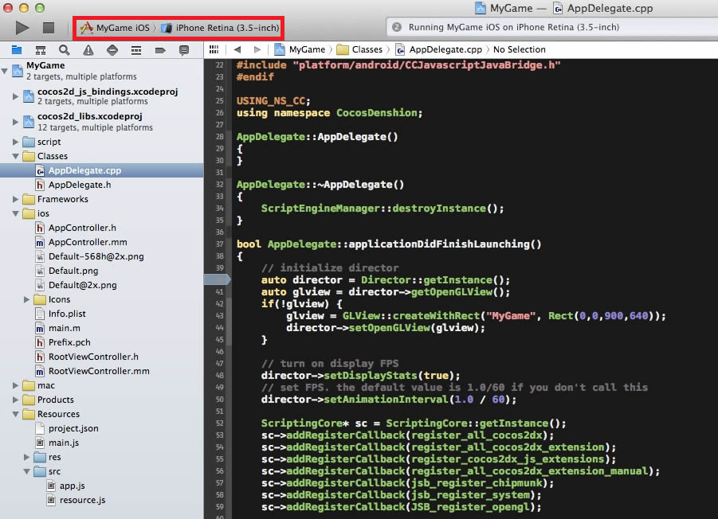

# IOS平台安装包编译打包

------

## 1. 环境配置

MacBook Air，操作系统版本是10.9.3，Xcode版本是5.1.1。把cocos2d-js解压到/Users/x/cocos2d/cocos2d-js-v3.0-rc，配置环境变量：

```bash
xtekiMacBook-Air:cocos2d-js-v3.0-rc0 x$ ./setup.py

Setting up cocos2d-x...
->Check environment variable COCOS_CONSOLE_ROOT
  ->Find environment variable COCOS_CONSOLE_ROOT...
    ->COCOS_CONSOLE_ROOT is found : /Users/x/cocos2d/cocos2d-js-v3.0-rc0/tools/cocos2d-console/bin

->Configuration for Android platform only, you can also skip and manually edit "/Users/x/.bash_profile"

->Check environment variable NDK_ROOT
  ->Find environment variable NDK_ROOT...
    ->NDK_ROOT not found

  ->Please enter the path of NDK_ROOT (or press Enter to skip):
->Check environment variable ANDROID_SDK_ROOT
  ->Find environment variable ANDROID_SDK_ROOT...
    ->ANDROID_SDK_ROOT not found

  ->Please enter the path of ANDROID_SDK_ROOT (or press Enter to skip):
->Check environment variable ANT_ROOT
  ->Find environment variable ANT_ROOT...
    ->ANT_ROOT not found

  ->Find command ant in system...
    ->Command ant not found

  ->Please enter the path of ANT_ROOT (or press Enter to skip):

Please execute command: "source /Users/x/.bash_profile" to make added system variables take effect

xtekiMacBook-Air:cocos2d-js-v3.0-rc0 x$ source /Users/x/.bash_profile
```

主要就是配置cocos命令路径的环境变量，其他是针对android的，[android平台安装包编译打包文档见这里](build-apk.md)。

## 2. 测试项目

生成一个测试项目：

```bash
xtekiMacBook-Air:cocos2d-js-v3.0-rc0 x$ cocos new MyGame -l js -d /Users/x/project/ 
```

最方便的测试方法是用Xcode打开`frameworks/js-bindings/bindings/proj.ios_mac/`下的项目文件，如下图：



注意红框框住的地方，一定要选这个像A的图标的`MyGame iOS`，右边选模拟器，然后按最左边那个类似播放键的按钮，就开始编译，编译完自动在模拟器里运行。在Xcode里可以调试jsb底层的C++代码，但无法调试里面的javascript代码，不过可以用[firefox连上来调试javascript](debug.md)。

## 3. 命令行编译

```bash
xtekiMacBook-Air:cocos2d-js-v3.0-rc0 x$ cd /Users/x/project/MyGame
xtekiMacBook-Air:MyGame x$ cocos compile -p ios
```

编译后，在项目目录的runtime/ios/下生成MyGame.app目录包，然后可以用xcrun打包：

```bash
xtekiMacBook-Air:MyGame x$ xcrun -sdk iphoneos PackageApplication /Users/x/project/MyGame/runtime/ios/MyGame.app -o /Users/x/project/MyGame/MyGame.ipa
xtekiMacBook-Air:MyGame x$ ls -l
total 18328
-rw-r--r--  1 x  staff  9370194  6 16 16:42 MyGame.ipa
...
```

默认这样编译，生成的ipa文件是i386指令集，用于模拟器测试调试。

## 4. 真机安装包编译

真机安装包需要证书签名，开发阶段一般有两种：开发和发布，本节讨论的是企业内部发布的in-house证书。

首先，在苹果开发者网站`https://developer.apple.com/account/ios/identifiers/bundle/bundleList.action`配置App ID，这个App ID后面编译的时候要用到。然后到`https://developer.apple.com/account/ios/profile/profileList.action?type=production`下载刚才设置App ID的Profile，下载到本地后双击。

双击项目目录`frameworks/runtime-src/proj.ios_mac/`下的xcodeproj文件，在打开的xcode里设置`General`里的`Bundle Identifier`，注意和App ID匹配，下面的`Team`选择企业发布证书。如果是横屏的游戏，那么在下面的`Device Orientation`勾选"Landscape Left"和“Landscape Right”，如果是竖屏游戏，那么勾选“Portrait”和“Upside Down”。然后在`Build Settings`的`Code Signing Identity`选择开发还是发布，最后在下面的`Provisioning Profile`选择刚才在苹果开发网站下载的Profile。

编译脚本`cocos2d-js-v3.0-rc0/tools/cocos2d-console/plugins/project_compile/project_compile.py`相对于beta版，对ios相关的编译做了很多改进，release模式编译，不但加了编码js文件，还加了xcrun打包成ipa文件，但还是有要吐槽的地方，就是debug模式只能编译i386指令集模拟器版本。

如果要在模拟器里跑，那么如上述直接在Xcode里跑多方便，而很多时候我们需要拿debug方式编译的ipa给测试人员，这样有问题可以方便的用firefox调试。所以稍微改了下project_compile.py：

```
    def build_ios(self):
...
            command = ' '.join([
                "xcodebuild",
                "-project",
                "\"%s\"" % projectPath,
                "-configuration",
                "%s" % 'Debug' if self._mode == 'debug' else 'Release',
                "-target",
                "\"%s\"" % targetName,
                #"%s" % "-arch i386" if self._mode == 'debug' else '',
                "-sdk",
                "iphoneos",
                #"%s" % 'iphonesimulator' if self._mode == 'debug' else 'iphoneos',
                "CONFIGURATION_BUILD_DIR=%s" % (output_dir)
                ])
...
            if self._mode == 'release' or self._mode == 'debug':
                # generate the ipa
                app_path = os.path.join(output_dir, "%s.app" % app_name)
                ipa_path = os.path.join(output_dir, "%s.ipa" % app_name)
                ipa_cmd = "xcrun -sdk iphoneos PackageApplication -v \"%s\" -o \"%s\"" % (app_path, ipa_path)
                self._run_cmd(ipa_cmd)
```

这里把iphonesimulator改成iphoneos，i386改成空（就是armv7），然后在项目目录执行`cocos compile -p ios`，编译到最后的时候，会调用codesign来做一个签名，会弹出一个钥匙串访问的对话框，选总是允许就可以了。

编译好后，在`runtime/ios/`目录下生成ipa文件。

对于企业证书，要想让测试人员自己通过网页安装这个ipa文件，还需要一个plist文件配合：

```
<?xml version="1.0" encoding="UTF-8"?>
<!DOCTYPE plist PUBLIC "-//Apple//DTD PLIST 1.0//EN" "http://www.apple.com/DTDs/PropertyList-1.0.dtd">
<plist version="1.0">
<dict>
  <key>items</key>
  <array>
    <dict>
      <key>assets</key>
      <array>
        <dict>
          <key>kind</key>
          <string>software-package</string>
          <key>url</key>
          <string>https://xxx.xxx.xxx/magic/MyGame.ipa</string>
        </dict>
      </array>
      <key>metadata</key>
      <dict>
        <key>bundle-identifier</key>
        <string>com.xxx.xxx</string>
        <key>bundle-version</key>
        <string>alpha</string>
        <key>kind</key>
        <string>software</string>
        <key>title</key>
        <string>MyGame</string>
      </dict>
    </dict>
  </array>
</dict>
</plist>
```

最后，用这样的html，用户就可以点击下载安装：

```
<a href="itms-services://?action=download-manifest&url=https://xxx.xxx.xxx/magic/MyGame.plist">点击安装(ios)</a>
```

IOS 7.1以上版本必须要https才可以正常安装，可以到Godaddy买一个https证书。上述的xxx麻烦自行修改一下。
