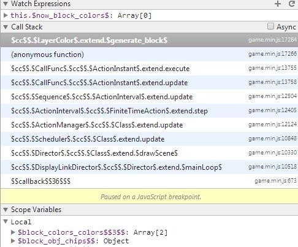

# cocos2d-js 3.0编译WEB版若干问题

------

## 1. 如何生成编译调试版本

------

随着神经猫的风靡，越来越多的童鞋开始用cocos2d-js做微信小游戏，cocos2d-js提供了可裁剪、混淆压缩的编译方式：

```
cocos compile -p web -m release
```

cocos2d-js使用了google closure compiler做混淆压缩，不过如果你编码稍微不注意，很可能编译出来的代码会运行出错，而这个代码实在没法看和调试，给排错照成很大困扰。

cocos提供了生成sourcemap文件的选项，只需用如下命令编译即可：

```
cocos compile -p web -m release --source-map
```

要生成sourcemap，jdk的版本必须是1.7，这个在`cocos2d-js-v3.0-rc2/tools/cocos2d-console/plugins/project_compile/build_web/__init__.py`里定义了，但脚本里对1.6版本jdk的童鞋做任何提示。不过sourcemap对closure compiler压坏的代码调试没啥帮助，林顺推荐了一个方法，就是改build.xml里的debug选项为true：

```xml
<?xml version="1.0"?>
<project name="Javascript compress project" basedir="/home/magic/project/test" default="compile">

    <taskdef name="jscomp" classname="com.google.javascript.jscomp.ant.CompileTask"
             classpath="/home/magic/cocos2d-js-v3.0-rc2/tools/cocos2d-console/bin/../plugins/project_compile/build_web/bin/compiler-1.7.jar"/>

    <target name="compile">
        <jscomp compilationLevel="advanced" 
                warning="quiet"
                debug="true" 
                output="/home/magic/project/test/publish/html5/game.min.js"
......
```

然后删除`game.min.js`，重新生成：

```
/home/magic/apache-ant-1.9.4/bin/ant -f /home/magic/project/test/publish/html5/build.xml
```

新生成的game.min.js有很多`$`符号，但函数名、变量名等和源码一致，不过代码没有换行，都合在一起，需要用sublime的JsFormat插件等工具（线上可以用：http://jsbeautifier.org/）做一下美化，然后调试就比较方便，看看closure compiler到底把哪压坏了。chrome下debug信息大概如下：



## 2. 阻止closure compiler混淆特定变量名

就是在该行代码上面加一行：

```javascript
/** @expose */
```

比如cocos2d-js 3.0 rc2发布后，发现编译混淆后，又出现如下错误：

```
Error: res/click.mp3 greater than 5
```

panda连夜看了代码后，给了一个解决方案，在CCAudio.js中，修改下面的代码：

```javascript
            /** @expose */
            sourceNode.onended = function(){
                self._stopped = true;
            };
```

这个bug是因为onended变量名被混淆后事件注册失败。

## 3. 经验教训

------

* var k = {name : 'value'}; 这里的name如果加了引号，一准被closure compiler压坏
* 对象成员取值不要用k['name']，这样也容易被closure compiler压坏，要用k.name
* 不想closure compiler混淆的变量名，在其上面加`/** @expose */`

## 4. 参考文档

------

* http://www.cocoachina.com/bbs/read.php?tid=216020
